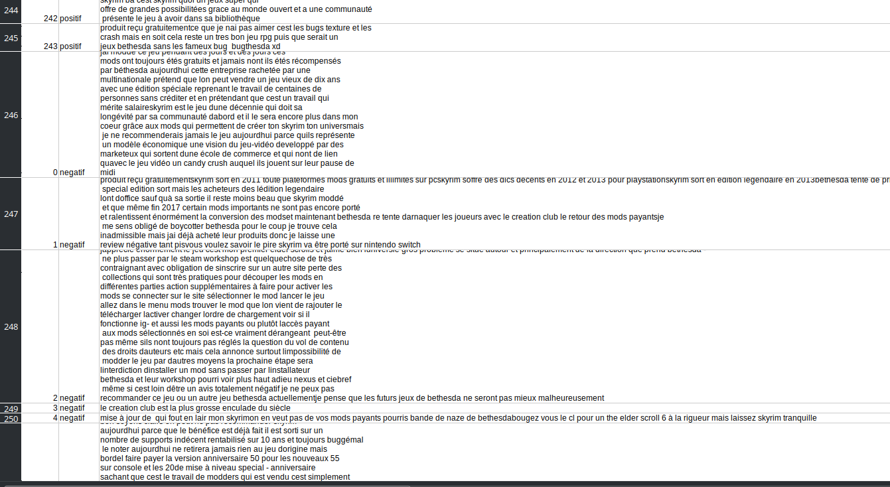

# Analyse des sentiments commentaire Steam sur le jeu Skyrim
---------------

- GILLET Baptiste
- VAN-DEN-ZANDE Débora 


# Choix du Sujet

Débora et moi sommes deux passionnés de jeux vidéos et lorsque l'enjeu de ce projet nous a été présenté nous avons de suite penser à le relier à ce domaine.
Nous avons décidé de nous servir de la platforme steam qui lors du parcours du ./robots de la page n'interdisait pas le scrapping. 
Pour ce qui est du choix du jeu nous avons décidé de prendre un monument du jeu qui suscite beaucoup de commentaire à savoir "**Skyrim**".


### Librairies utilisées 

- Sckipit Learn
- BeautifulSoup : pour scrapper nos pages steam
- Langdetect : pour identifier et cibler la langue française
- re : pour les expressions régulières (utile lors du prétraitement)
-----

# Organisation du projet :

Vous retrouverez dans notre Github, les différents scripts qui nous ont permis de récuppérer les commentaires.
La logique était la suivante, nous récupérons, grâce au script extraction,les commentaires positifs d'un côté et les négatifs de l'autre grâce à BeautifulSoup. Pour chaque commentaire nous créons un fichier.
Les commentaires sont rangés dans des fichiers commentaire_negatif, commentaire positif.


## Prétraitement des données

Nous le savons les gamers ont tendance à être assez tatillon lorsqu'il s'agit de laisser un commentaire sur un jeu qu'ils aiment où non. Nous avons été confronté à plusieurs difficultés qu'il a fallu gérer lors du prétraitement de nos données pour pouvoir homogéneiser nos commentaires. 
- **Les caractères d'espacement** : effectviement lorsque nous récuppérions les commentaires ceux si comportaient beaucoup de caractères d'echappement certainement dû au formatage de Steam.
- **Commentaire en anglais** : Certains commentaires étaient rédigés en anglais, bien que lors de notre extraction nous avons mis le filtre **commentaire en français** sur Steam. Cela signifie probablement que l'utilisateur à un compte français mais rédige son commentaire en anglais. Il a fallu gérer ces commentaires et pour cela nous avons utilisé la librairie **langdetect** et son module detect.
- **Commentaire graphique** : Certains commentaires graphique ne pouvait pas être traiter avec langdetect car il ne comprenait pas. Nous avons donc importer la librairie **re** afin de spécifier que nous ne voulions pas de caractères 


qui est l'équivalent de :


## Erreurs qui ont pris du temps 
Nous ne comprenions pas pourquoi certains caractères étaient mal encodés, pourtant le contenu de nos fichiers était écrit en UTF-8 pareil pour notre csv. 
Il s'est avéré que c'était une erreur dûe à notre regex qui éliminait tous les caractères diacrités.
Il a fallu la modifier :
```py
cleaned_text = re.sub(r'[^a-zA-Z\s-]', '', tag.get_text()) 

par : 

cleaned_text = re.sub(r'[^\w\s-]', '', tag.get_text()) 
```


## Résultats de notre CSV final : 

On se retrouve avec 245 commentaires négatifs et 245 commentaires positifs (nous avons fait en sorte d'obtenir le même nombre d'avis) et grâce à la dataclass **Commentaire**, nous écrivons le contenu des commentaires dans un csv.




